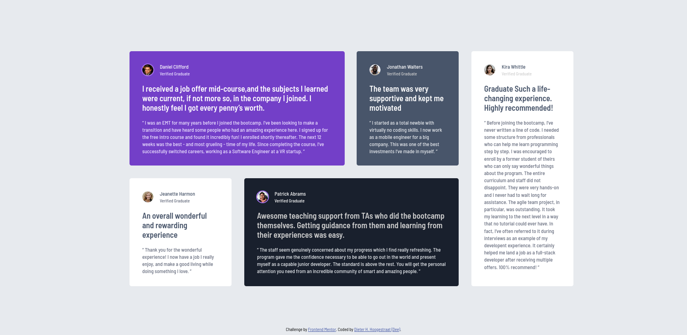

# Frontend Mentor - Testimonials grid section solution

This is a solution to the [Testimonials grid section challenge on Frontend Mentor](https://www.frontendmentor.io/challenges/testimonials-grid-section-Nnw6J7Un7). Frontend Mentor challenges help you improve your coding skills by building realistic projects. 

## Table of contents

- [Overview](#overview)
  - [The challenge](#the-challenge)
  - [Screenshot](#screenshot)
  - [Links](#links)
- [My process](#my-process)
  - [Built with](#built-with)
  - [What I learned](#what-i-learned)
  - [Continued development](#continued-development)
- [Author](#author)


**Note: Delete this note and update the table of contents based on what sections you keep.**

## Overview

### The challenge

Users should be able to:

- View the optimal layout for the site depending on their device's screen size

### Screenshot




### Links

- Solution URL:[ https://github.com/vanhog/frontend-mentor-testimonial-grid-sct](https://github.com/vanhog/frontend-mentor-testimonial-grid-sct)
- Live Site URL: [https://dees-frontend-mentor-testimonial-grid.netlify.app/](https://dees-frontend-mentor-testimonial-grid.netlify.app/)

## My process

### Built with

- Semantic HTML5 markup
- CSS custom properties
- Flexbox
- CSS Grid
- Mobile-first workflow

### What I learned

Even though, this was a "grid challenge", I chose for flexbox to handle the transition from the mobile to tablet view. I used flex-grow to achieve the given layout.

```  
.card-1 {
    flex: 1 0 16rem;
  }
  
```

### Continued development

Writing the same CSS- and HTML-code again and again is quite a bit painful. So, I'm looking forward to working with a framework.


## Author


- Website - [Dieter H. Hoogestraat (Dee)](https://www.hoogestraat.com)
- Frontend Mentor - [@vanhog](https://www.frontendmentor.io/profile/vanhog)

-